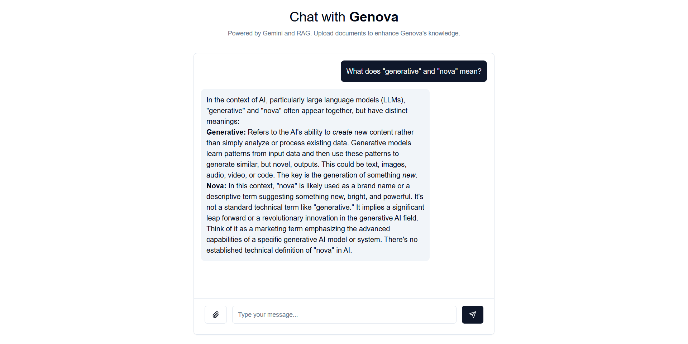

# Genova



**Genova** is an intelligent chatbot powered by [Google's Gemini AI](https://ai.google.dev/gemini-api/docs), enhanced with [Retrieval-Augmented Generation (RAG)](https://cloud.google.com/use-cases/retrieval-augmented-generation?hl=en) capabilities. It provides natural language interactions and can learn from uploaded documents to provide more informed responses.

## Features

- 🤖 AI-powered conversations using Google's Gemini API
- 📚 Document upload and processing for enhanced knowledge
- 🔍 Retrieval-Augmented Generation for context-aware responses
- 💻 Built with Next.js for optimal performance and SEO
- 🎨 Sleek UI design using Tailwind CSS and shadcn/ui components

## Tech Used

- **Front End:** Next.js, React, Tailwind CSS, shadcn/ui
- **Back End:** Google Gemini API, LangChain
- **Development Tools:** TypeScript, ESLint, PostCSS

## Prerequisites

Before you begin, ensure you have met the following requirements:

- Node.js (v22 or later)
- npm (v10 or later)
- A Google Cloud account with access to the Gemini API

## Installation

1. Clone the repository:

   ```bash
   git clone https://github.com/fhasnur/genova.git
   cd genova
   ```

2. Install the dependencies:

   ```bash
   npm install
   ```

3. Set up your environment variables:

   Create a `.env` file in the root directory and add the following:

   ```env
   GEMINI_API_KEY=your-google-gemini-api-key
   ```

## Usage

1. Start the development server:

   ```bash
   npm run dev
   ```

2. Open your browser and navigate to `http://localhost:3000`.

3. Upload documents and interact with the AI chatbot.

## Contributing

Contributions are welcome. To contribute, fork this repository, create a new branch, and submit a pull request. 

## License

This project is licensed under the MIT License. See the [LICENSE](LICENSE) file for details.